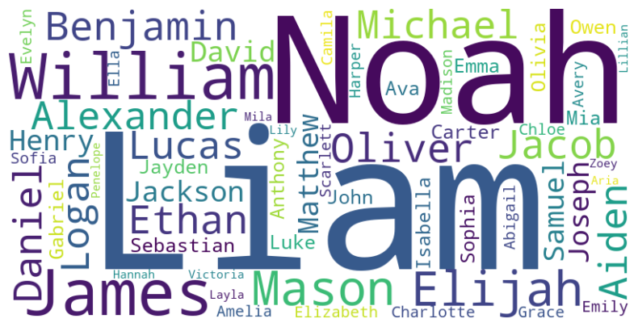

# Unveiling Trends: Exploring Baby Names in the United States

A Capstone Project for the Master of Applied Data Science Degree (University of Michigan School of Information) by Team 12 The Name Droppers (Jonathan Ellis, Jordan Marquez and Paul Schickler)

## Overview
Our project analyzes long-term US naming trends using the Social Security Administration's (SSA) baby name dataset from 1881 to 2022. We examine sex, counts, and state-level variations to identify historical naming shifts and regional differences. Additionally, we identify pop culture naming trends and build a forecasting model for names.

## Dataset

### Social Security Adminstration
This project uses baby name data from the Social Security Adminstration (SSA). The data can be downloaded from: https://www.ssa.gov/oact/babynames/limits.html. For privavy reasons, the SSA excluded names with fewer than 5 occurences in any geographic area. 
- National data: There is a txt file for each year of birth (1881-2022). Columns: name, M/F, and count. Contains 102,449 unique names
- State-specific data: there is a txt file for each state (and D.C.). Columns: state, M/F, year, name, count. Contains 32,722 unique names. 

### Kaggle
This project used the The Movies Dataset from Kaggle which contains metadata on over 45,000 movies. The dataset consists of movies released on or before July 2017. The movies_metadata.csv and credits.csv we used can be dowloaded here: https://www.kaggle.com/datasets/rounakbanik/the-movies-dataset/data.     
